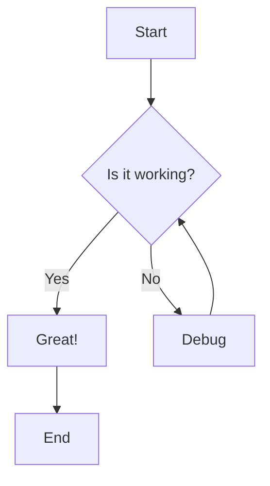
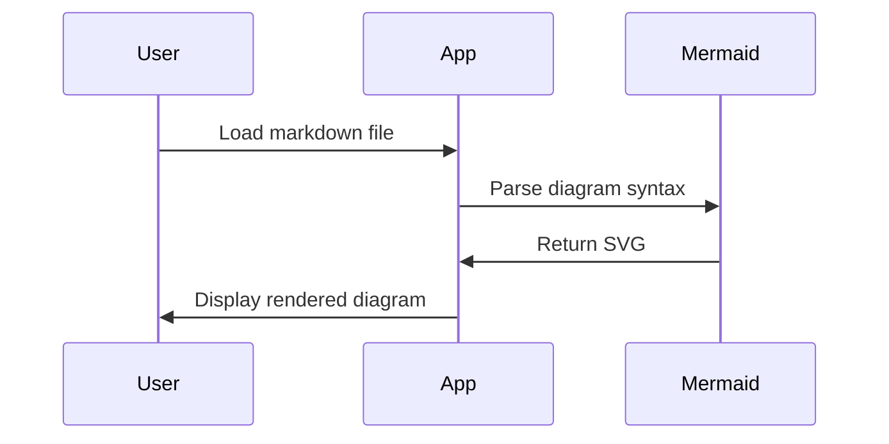
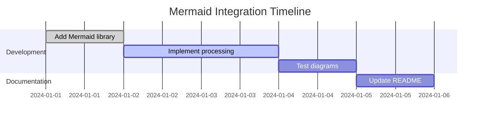
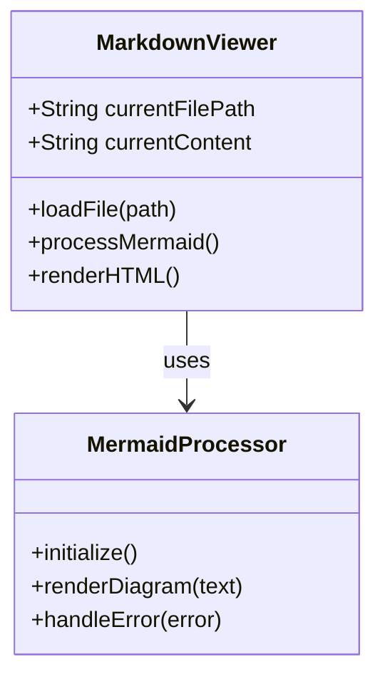
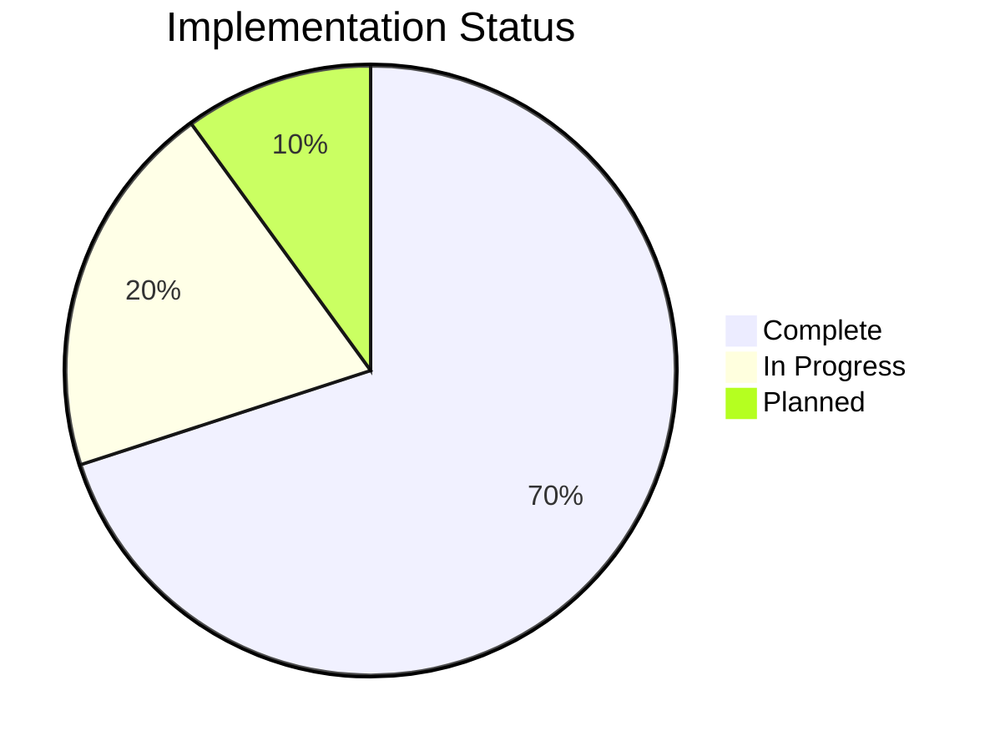

# Mermaid Diagram Test

This file tests the Mermaid diagram integration.

## Flowchart Example



## Sequence Diagram



## Gantt Chart



## Class Diagram



## Pie Chart



## Invalid Mermaid (should show error)

```mermaid
this is not valid mermaid syntax
it should show an error message
```

## Regular Code Block (should not be processed)

```javascript
// This is regular JavaScript, not Mermaid
console.log("This should stay as code");
```